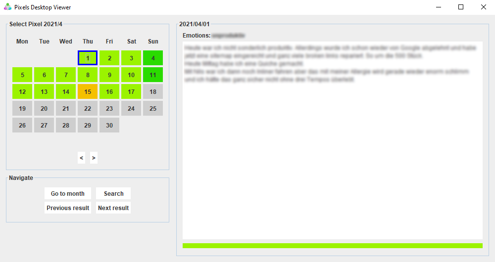
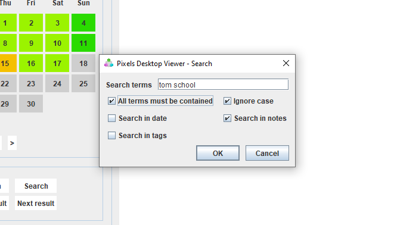

# Pixels viewer
A desktop viewer for the App [Pixels - Mood tracker](https://play.google.com/store/apps/details?id=ar.teovogel.yip&hl=de&gl=US), to view your exported json pixels.  
This software is not affiliated with [Pixels - Mood tracker](https://play.google.com/store/apps/details?id=ar.teovogel.yip&hl=de&gl=US), go support them there directly!

Download the [latest version here](https://github.com/Skyball2000/pixels-viewer/releases).
You will need at least [Java JDK 15](https://www.oracle.com/de/java/technologies/javase-jdk15-downloads.html) to run the viewer.

View all the pixels you created so far:

Search them for keywords:

